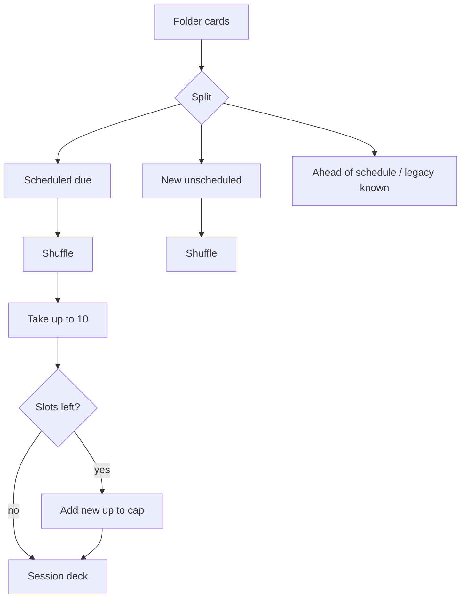

# Due-first learning session

How InkLex builds a **Start Learning** session so spaced repetition actually drives what the user sees.

Implementation: [`src/utils/reviewAlgorithm.ts`](../../src/utils/reviewAlgorithm.ts) — `isDue`, `isScheduledDue`, `isNewCard`, `buildSessionDeck`, `countSessionPool`.

## Goals

1. Prefer cards that are **due now** over farming ahead-of-schedule reviews.
2. Still introduce **new** words without drowning a due backlog.
3. Include **known** cards when their decay date has arrived (maintenance).

## Card buckets

| Bucket | Condition | Role |
|--------|-----------|------|
| Scheduled due | `next_review_at` present and `<= now` | Priority queue (learning or known) |
| New / unscheduled | `status !== known` and `next_review_at == null` | Fill after due |
| Ahead of schedule | `next_review_at > now`, not known | **Excluded** from Start Learning |
| Legacy known | `status == known` and `next_review_at == null` | **Excluded** until they get a decay schedule |

`isDue(card)` = scheduled due **or** new/unscheduled.

## Session build (`buildSessionDeck`)

Constants:

- `MAX_SESSION_SIZE = 10`
- `MAX_NEW_PER_SESSION = 5`

Algorithm:

1. Collect scheduled-due cards → shuffle → take up to 10.
2. Remaining slots: fill from new/unscheduled.
   - If there was **at least one** scheduled-due card → add at most **5** new.
   - If the due list was **empty** → allow up to **10** new (full new-only session).
3. Pass the deck into the learning UI queue.

## CTA counts (`countSessionPool`)

Shown on **Start Learning**:

- Prefer label `Start Learning (N due)` when there is scheduled due.
- Tooltip may show `N due · up to M new`.
- If only new cards: `Start Learning (sessionSize)`.

## Empty state

If the due-first pool is empty:

- Copy: **Nothing due now** (not “No cards due” when the issue is timing).
- If the folder still has ahead-of-schedule learning cards, mention that reviews are in the future.

## Related grading (not ordering, but schedule)

Documented here so session behavior stays consistent with scheduling:

| Grade | Effect |
|-------|--------|
| Again | Soft demotion one Leitner step; `next_review_at = now + 10m`; status `learning` |
| Good (learning) | `0 → 1d → 3d → 7d → known` with `interval_days = 30` |
| Good (known) | Extend maintenance interval `×1.5` (max 180d) |

In-session: a wrong answer is **requeued once** at the end of the queue before it counts as “Needs work”.

## Out of scope

- Full SM-2 / ease factor
- Typed recall (separate learning module)
- “Practice more” for ahead-of-schedule cards (optional future CTA)
