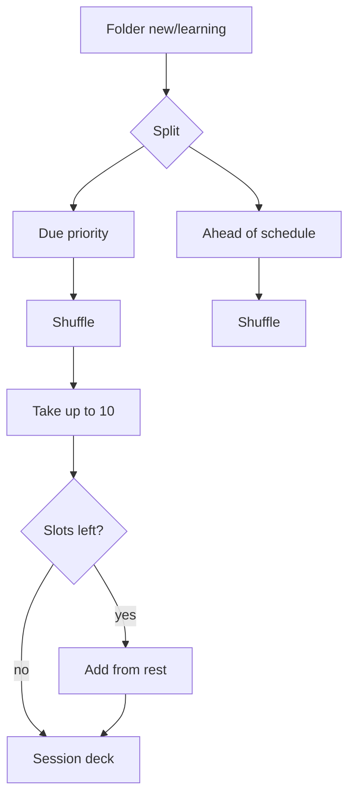

# Quest & Review sessions

How InkLex builds practice sessions so spaced repetition still prioritizes due words, without blocking the next Quest.

Implementation: [`src/utils/reviewAlgorithm.ts`](../../src/utils/reviewAlgorithm.ts) — `isDue`, `isScheduledDue`, `isNewCard`, `isQuestEligible`, `buildQuestDeck`, `countSessionPool`, `gradeCard`.

## Goals

1. Prefer cards that are **due now** when building a Quest deck.
2. Still allow practice of **ahead-of-schedule** Cards/Learning so the user can start another Quest immediately.
3. Exclude **Known** from Quest (they stay in Review / Known tab).
4. Promote to Known after **3 correct in a row** (or manual drag / editor).

## Learning entry

- **All** folder: Start Learning opens a **folder picker** (modal). Direct `/learning` shows the same picker as page content. Learning always runs inside a concrete folder.
- **Specific folder**: Start Learning → `/:encodedFolderId/learning` with **Learning Hub** as page content (Quest | Review), not a modal.
- Preference for last mode: `localStorage` `inklex.learningMode` = `quest` | `review`.

## Card buckets (Quest)

| Bucket | Condition | Role |
|--------|-----------|------|
| Quest pool | `status` is `new` or `learning` | Eligible for Quest |
| Due (priority) | In pool and (`next_review_at` null or `<= now`) | Taken first |
| Ahead of schedule | In pool and `next_review_at > now` | Fill remaining slots |
| Known | `status == known` | **Excluded** from Quest |

## Session build (`buildQuestDeck`)

Constants:

- `MAX_SESSION_SIZE = 10`
- `CORRECT_STREAK_TO_KNOWN = 3`

Algorithm:

1. Filter folder cards to Quest pool (new/learning).
2. Split into due vs rest → shuffle each.
3. Take due first (up to 10), then fill from rest until 10.
4. Pass the deck into the Quest UI queue.

## CTA counts (`countSessionPool`)

- `poolSize` = all new/learning in the folder
- `sessionSize` = `min(10, poolSize)`
- Quest is available whenever `sessionSize > 0` (not only when something is “due”)

## Grading → Known

| Grade | Effect |
|-------|--------|
| Again | `correct_streak = 0`; soft demotion one Leitner step; `next_review_at = now + 10m`; status `learning` |
| Good / Easy (not known) | `correct_streak += 1`; if `>= 3` → Known @ 30d; else stay `learning` with soft spacing intervals |
| Good (known) | Extend maintenance interval `×1.5` (max 180d) |
| Easy (known) | Extend maintenance interval `×2` (max 180d) |

Manual drag to Known tab / editor status = Known still uses `reviewFieldsForStatus` (resets streak).

In-session: a wrong / Again answer is **requeued once** at the end of the queue before it counts as “Needs work”.

## Learning UI modes

| Mode | Component | Pool | Input |
|------|-----------|------|--------|
| Quest | `LearningSession` | new/learning, max 10, due-first then rest | MCQ meanings (correct→good, wrong→again) |
| Review | `ReviewSession` | **All words in the active folder** (no max 10) | Flip reveal + Again / Good / Easy |

## Out of scope

- Full SM-2 / ease factor
- Typed recall (separate learning module)
