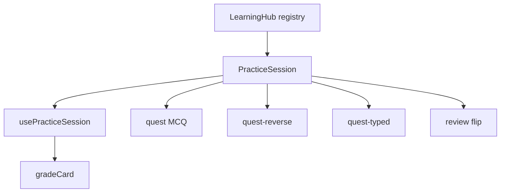

# InkLex — планування продукту

Документ фіксує: що вже зроблено після рефактору Quest/Review, наступні кроки, і **де шукати унікальність** відносно ринку (Anki / Duolingo / AI-vocab apps).

Пов’язані технічні docs: [`docs/algorithms/due-first-session.md`](../algorithms/due-first-session.md), [`docs/ai/WORKING-RULES.md`](../ai/WORKING-RULES.md).

---

## 1. Поточний стан (baseline)

### Вже є

| Область | Що |
|--------|-----|
| Карти / папки | `new` \| `learning` \| `known`, CSV import, drag між вкладками |
| Learning Hub | 4 формати практики як сторінка, не модал |
| Quest | MCQ word→meaning, due-first, max 10 |
| Reverse Quest | MCQ meaning→word |
| Typed Quest | набрати слово за значенням |
| Review | flip + Bad / Good / Easy, усі слова папки |
| Session shell | `usePracticeSession` + `PracticeSession` + `practiceFormats` |
| SRS | soft Leitner + streak 3 → Known; again лише після фінального settle |
| UX | pronounce, streak «N/3 to Known», keyboard, resume через sessionStorage |
| Тести | Vitest на `reviewAlgorithm` |

### Технічний каркас для росту

Новий формат ≈ запис у реєстрі + Prompt у shell, **без** копіювання queue/persist/summary.

---

## 2. Roadmap після плану покращень

План «Quest improvements» (P0–P2 + нові формати) **виконано**. Нижче — наступні хвилі пріоритетів.

### Wave A — закріпити ядро (1–2 тижні)

Мета: стабільний «особистий словник + практика», без роздування scope.

1. **Полірування форматів** — empty states, mobile keyboard на Typed, чіткіші tips.
2. **Метрики сесії** (локально) — скільки settled / again / promote to Known за день.
3. **Якість карток** — валідація дублікатів word+folder; підказка «додай example».
4. **Auth / sync** — реалізовано: Google + email/password, owner-only Firestore,
   mock dev-user. Rollout і legacy migration:
   [`AUTH-MIGRATION.md`](./AUTH-MIGRATION.md).

### Wave B — диференціація «мій лексикон» (2–6 тижнів)

Мета: InkLex ≠ ще один Anki/Quizlet-клон.

| Ідея | Чому унікально для нас | Складність |
|------|------------------------|------------|
| **Capture з життя** — швидке додавання слова з буфера / share sheet / «paste sentence → extract word» | Конкуренти (Palabrium, Worzup, Vokabulo) будують бренд навколо *твоїх* слів, не generic lists | M |
| **Контекстний example** — AI або шаблони: новий приклад на кожен review (не той самий рядок з картки) | Знижує pattern-matching по картці; Vocabulex / Memofluent саме цим відрізняються | M–H |
| **Production quest** — сказати визначення / коротке речення вголос (speech + простий match) | Fufive: «digest by speaking»; у нас уже є pronounce — логічний наступний крок | H |
| **Folder = life domain** — Work / Series / Docs як сценарії, не просто ярлики | UX уже folder-first; можна продавати як «лексикон твого життя» | L (copy + templates) |

### Wave C — алгоритм і глибина (опційно, після B)

| Ідея | Інструмент / джерело | Нотатка |
|------|----------------------|---------|
| **FSRS** замість/поверх soft Leitner | [`ts-fsrs`](https://www.npmjs.com/package/ts-fsrs) (Open Spaced Repetition) | Краща ретенція; потрібні поля stability/difficulty + review log |
| Matching / cloze як формат | наш `PracticeFormat` registry | Низький ROI, якщо Typed уже є |
| Listening-only quest | Free Dictionary / TTS уже в проєкті | Не як окремий «режим ринку», а варіант prompt |

**Не пріоритет зараз** (з попереднього плану): повний SM-2 ease factor «з нуля», Known у Quest pool, listening як окремий продукт.

---

## 3. Ринок: що вже зайнято

Типові AI-vocab продукти 2025–26:

| Патерн | Хто | Що продають |
|--------|-----|-------------|
| Capture → AI card → SRS | [Palabrium](https://palabrium.ai/), [Worzup](https://worzup.com/), [Vokabulo](https://www.vokabulo.com/en) | «Слова з твого дня» |
| Context sentences + SRS | [Memofluent](https://memofluent.com/), [Vocabulex](https://vocabulex.app/) | слово в живому реченні |
| Speak / micro-batch | [Fufive](https://fufive.com/) | 5 слів/день + speaking |
| Life-scenario AI lessons | [Mynago](https://mynago.com/blog/myna-method) | уроки з твого контексту життя |
| Power-user SRS | Anki + FSRS | максимум контролю, мінімум UX |

**Висновок:** голий MCQ + folders вже не дивує. Унікальність з’являється на стику:

1. **Personal lexicon** (твій контент),  
2. **Retrieval у різних форматах** (у нас уже 4),  
3. **Один чіткий ритуал** (коротка сесія, due-first, без «плануй сам»).

InkLex вже сильний у (2)+(3). Найбільший розрив до ринку — **(1) capture + свіжий контекст**.

---

## 4. Рекомендована позиція InkLex

> **InkLex — desk для особистого словника:** швидко зберігаєш слова, практикуєш їх у кількох режимах (впізнавання → reverse → typed → self-grade), повертаєшся due-first без налаштування Anki.

### Унікальні ставки (обрати 1–2 як «північна зірка»)

**Ставка A — «From clipboard to Known»**  
Шлях: побачив слово → 1 тап додати → Quest сьогодні → Typed завтра → Known.  
Диференціатор: швидкість циклу + кілька форматів у одному shell.

**Ставка B — «Same word, new sentence»**  
На кожному review — новий приклад (AI або банк речень).  
Диференціатор: recall у контексті, не запам’ятовування однієї картки.

**Ставка C — «Speak the meaning»**  
Короткий speaking-quest поверх існуючого pronounce.  
Диференціатор: production, не лише tap.

Рекомендація: **A як MVP диференціації**, B як наступний шар, C якщо з’явиться голос/мовний фокус.

Тікети на імплементацію ставки A: [`CAPTURE-MVP.md`](./CAPTURE-MVP.md) (T1–T4).

---

## 5. Будівельні блоки ззовні (що можна підключити)

| Блок | Навіщо | Лінк / нотатка |
|------|--------|----------------|
| **ts-fsrs** | сучасний scheduler замість фіксованих 1/3/7 | [npm ts-fsrs](https://www.npmjs.com/package/ts-fsrs), Node ≥20 |
| **Open Spaced Repetition** | docs + optimizer параметрів з логів | [GitHub org](https://github.com/open-spaced-repetition) |
| **Tatoeba / подібні корпуси** | живі приклади без AI-cost | як у Memofluent |
| **Free Dictionary API** | уже використовуємо для pronunciation | лишити як free path |
| **LLM (опційно)** | extract word from paste, generate example, CEFR hint | лише там, де UX виграє від AI; інакше InkLex лишається «швидким desk» |

Принцип: AI — **прискорювач capture/контексту**, не заміна SRS і не головний екран.

---

## 6. Критерії успіху (продукт)

| Метрика | Сигнал |
|---------|--------|
| Сесії / тиждень на активного | ритуал працює |
| % карток, що дійшли до Known | streak + formats ефективні |
| Час «paste → перша картка» | capture-ставка A |
| Повторний старт Quest без due | due-first + ahead fill (вже є) |
| Typed / Reverse usage share | люди йдуть глибше за MCQ |

---

## 7. Наступне рішення (для власника продукту)

Перед наступною імплементацією обрати одне:

1. **Capture flow** (clipboard / paste sentence → card), або  
2. **Fresh example on review**, або  
3. **Speaking micro-quest**.

Технічний фундамент (shell + 4 формати + due-first) готовий під будь-який з цих напрямів.
